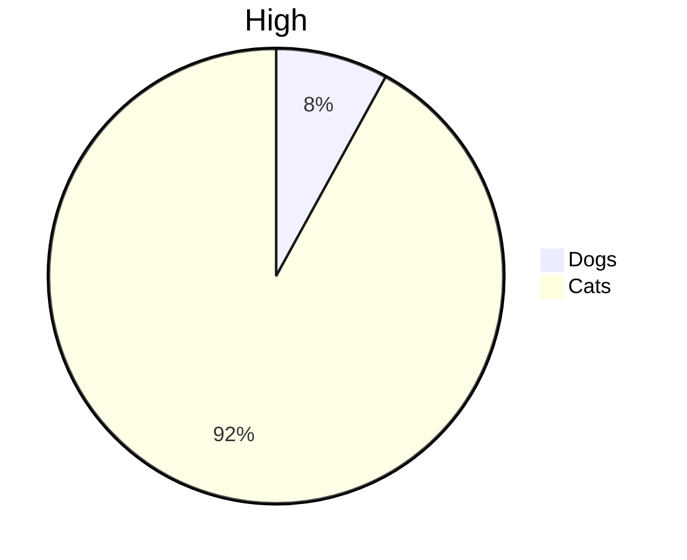

## Vulnerability Detect Result



```flow
st=>start: Start
op=>operation: Your Operation
cond=>condition: Yes or No?
e=>end

st->op->cond
cond(yes)->e
cond(no)->op
```

## Re-Entrancy [High] in #15


### [Description]
Re-entrancy is a flaw that allows a function in a contract to be called repeatedly before the function completes its previous execution.
In the -withdraw- function, -balances- is updated after sending balances to the call function.
In the process of sending -balances- to the call function, if the recipient writes code to execute the -withdraw- function inside the receive / fallback function, it can reenter the function.

### [Solution]
Use mutex that places a lock on the contract state.
Write code CEI(checks-effects-interactions) pattern.
(Perform any checks, which are assert and require statments, at the beginning of the function. If the checks pass, the function should then resolve all the effects to the state of the contract. Only after all state changes are resolved should the function interact with other contracts.)